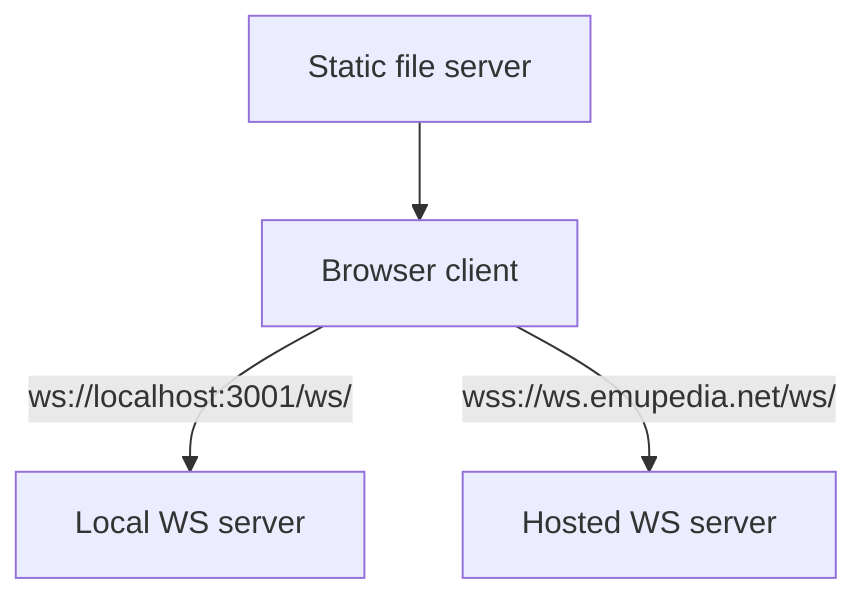

# Getting Started

## Welcome

This is the day-one guide for the repo. By the end, you should be able to run the static client locally, connect it to a local WebSocket server when needed, and know which files to read first before making changes.

> See the [Architecture Overview](overview.md) if you want the higher-level picture first.

---

## Prerequisites

You do not need a build pipeline for this project.

- A modern browser with ES module support
- A local static file server for browser testing, for example `npx serve`
- A local WebSocket server if you want multiplayer against localhost
- Node.js only if you plan to use `npx`-based tools or run the local WS server

---

## Development Environment



The client auto-selects the WebSocket endpoint based on hostname. `localhost` and `127.0.0.1` use the local endpoint; everything else uses the hosted endpoint.

---

## Running the Project

### 1. Static site only

If you just want the browser client and are okay with local fallback when multiplayer is unavailable:

```bash
cd E:\dev\spacerust\cojmar\night-vibe-online
npx serve . -l tcp://0.0.0.0:3000
```

### 2. Local multiplayer testing

If you have the separate multiplayer backend repository available, run the WebSocket server in one terminal and the static site in another:

```bash
cd E:\dev\spacerust\cojmar\ws-server
npm start
```

```bash
cd E:\dev\spacerust\cojmar\night-vibe-online
npx serve . -l tcp://0.0.0.0:3000
```

Open `http://localhost:3000` in the browser.

> Note: the multiplayer server code is not part of this repo; the `ws-server` path is a separate sibling project if available.

---

## Project Layout

```text
.
├── index.html                  # DOM shell, layout, CSS, overlays
├── app/
│   ├── main.js                 # App bootstrap and startup routing
│   ├── game.js                 # Core game loop, host logic, rendering state
│   ├── ui.js                   # HUD, menus, config editor, inventory UI
│   ├── network.js              # BSON WebSocket room client
│   ├── config.js               # Runtime gameplay config and metadata
│   ├── player.js               # Local and remote player model
│   ├── enemy.js                # Enemy and boss behavior
│   ├── projectile.js           # Projectile behavior and collisions
│   └── utils.js                # Shared constants and helpers
├── assets/                     # Third-party browser libraries and resources
├── ast-grep/                   # Project-specific structural rules
├── graphify-out/               # Generated architecture output
└── README.md                   # User-facing overview and run commands
```

---

## Where to Start Reading

- Startup flow: `index.html` -> `app/main.js`
- Match lifecycle: `app/game.js`
- HUD and menus: `app/ui.js`
- WebSocket state mapping: `app/network.js`
- Balance tuning: `app/config.js`

---

## Suggested Reading Order

1. [Architecture Overview](overview.md)
2. [Runtime Bootstrap](runtime-bootstrap.md)
3. [Game Loop & Host Model](game-loop-and-host-model.md)
4. [Network & Room Sync](network-and-room-sync.md)
5. [Config & Balance Editor](config-and-balance-editor.md)
6. [Mobile Layout & Input](mobile-layout-and-input.md)
7. [Testing & Review Workflow](testing-and-review-workflow.md)