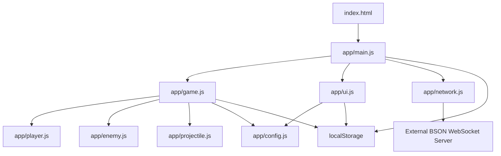

# Architecture Overview

## What This Project Does

This repository is a single-page vanilla JavaScript arena combat game with lightweight multiplayer. The browser client owns almost everything that matters at runtime: startup, simulation, combat, progression, HUD, inventory, balance editing, and room synchronization. A BSON WebSocket connection shares state between players, but the game can also start in a local fallback mode when multiplayer is unavailable.

This wiki documents the current implementation, not a frozen design. The codebase is actively changing, so treat these pages as a practical map of how the repo works today.

## System Architecture

The repo is intentionally flat. `index.html` contains the DOM shell and almost all CSS. `app/main.js` bootstraps the app and decides whether the game starts in online or offline mode. `app/game.js` is the core engine and session coordinator. `app/ui.js` owns menu logic, HUD updates, modal workflows, and the dynamic balance editor. `app/network.js` is a small evented wrapper over the older BSON room protocol. `app/config.js` exposes runtime-tunable gameplay values as live exports.

## Technology Stack

| Area | Technology |
|---|---|
| Language | Vanilla JavaScript ES modules |
| Rendering | Canvas 2D plus DOM/CSS overlays |
| Networking | WebSocket with BSON payloads, JSON fallback parsing |
| Persistence | `localStorage` for client-side progression, settings, and custom config |
| Deployment | Static hosting, no build step |
| Tooling | ESLint, ast-grep, graphify, code-review-graph |

## Modules at a Glance

`app/main.js` is the runtime entry point. It wires `Network`, `UI`, and `Game`, manages nickname setup, listens for auth/connect/disconnect events, and falls back to local mode when the WebSocket path stalls.

`app/game.js` is the largest and most important file. It owns the session state (`MENU`, `PLAYING`, `GAME_OVER`), wave progression, host logic, enemy spawning, player state restoration, rebirth, local persistence, rendering layout, and multiplayer synchronization.

`app/ui.js` is the DOM-facing control layer. It binds buttons, class selection, stat upgrades, modal dialogs, the dynamic config editor, logs, inventory UI, and HUD updates. It is a UI controller, not a second game engine.

`app/player.js`, `app/enemy.js`, and `app/projectile.js` hold the per-entity behavior and data models the game loop operates on.

`app/config.js` is the gameplay tuning surface. It merges hardcoded defaults, JSON defaults, and browser-local overrides into a live set of exported values used throughout the runtime.

`index.html` is more than markup. It is the layout system, menu shell, modal host, HUD scaffold, and most of the responsive/mobile styling.

## Key Flows

- Startup flows through `index.html` -> `app/main.js` -> `Network` / `UI` / `Game`, with an auth timeout and disconnect fallback that can boot the app into local mode.
- Match start flows through `Game.startGame()`, which restores local progression, checks for an existing host, optionally inherits host state, and then broadcasts the local player state.
- Moment-to-moment multiplayer flows through `room.user_data` events, where each client merges remote player state, host data, and synced gameplay config into its local view.
- Balance editing flows from `app/config.js` metadata into dynamically generated UI controls in `app/ui.js`, with active values written back to live exports and persisted to `localStorage`.

## Critical Paths

If you only read a few files, start with these:

1. `app/main.js` for bootstrap and online/offline entry behavior.
2. `app/game.js` for the real ownership model of gameplay and host state.
3. `app/ui.js` for menu, HUD, config editor, and inventory behavior.
4. `app/network.js` for room event mapping and reconnect behavior.
5. `index.html` for layout and mobile-facing regressions.

## See also

- [Getting Started](getting-started.md)
- [Runtime Bootstrap](runtime-bootstrap.md)
- [Game Loop & Host Model](game-loop-and-host-model.md)
- [Testing & Review Workflow](testing-and-review-workflow.md)